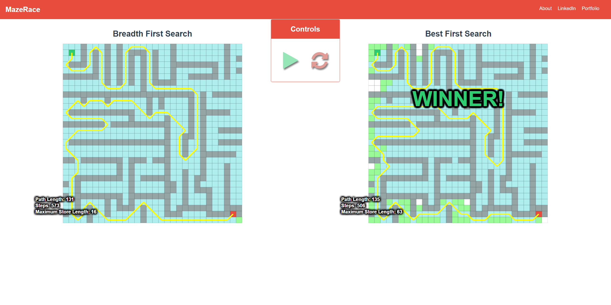

# MazeRace

[MazeRace live][ghpages]

[ghpages]: https://toddnestor.github.io/mazerace/
[development-readme]: ./docs/README.md

[MazeRace][ghpages] compares algorithms such as Breadth First Search, A\*, Best First Search, and Depth First Search.  Maze Race is inspired by [Pathfinder.js](https://qiao.github.io/PathFinding.js/visual/)

It shows a visual representation of how the algorithms work.  It also shows those algorithms happening side-by-side for a visual comparison.  Like Pathfinder.js, Maze race has a grid where a start and end point can be placed.  Walls can also be placed that the search algorithms will have to go around when searching for the endpoint.

Users can create the maze by setting the start/end positions and placing walls on a grid.  Then they can choose from the algorithm options and watch how the maze gets solved, and compare the algorithms with each other.

When the user presses "Start" the grid is duplicated and side-by-side grids are displayed.  Each step lights up the square actively being searched on each grid based on the algorithms being used.  A square remains lit up until one of it's children squares is searched so the perimeter that has been searched will be lit up. When the end is found a line will be rendered to show the path from the start point to the end point.

One thing to keep in mind is that in MazeRace it is only considered one step to get from a square to it's neighbor regardless of whether the neighbor is diagonal from the square or not.  This leads to paths that are considred equal lengths even though one may technically be longer due to diagonal movement.

[MazeRace][ghpages] is a personal project of Todd Nestor.



## Features

### Place a start position, end position, and walls on a grid

  Users can move the start and end positions by clicking and dragging them.  The red square is the end, the green one is the start.  Clicking any of the white squares turns it into a wall, and clicking a wall turns it back into a normal square.


### Select which algorithms to compare

  Users can select two algorithms to compare, or one just to watch it solve the map.  Users can also set whether or not to allow diagonal movement between squares.

  

### Start, pause, and reset the simulation

  Users can press the play button to have the algorithms start solving the maze.  While it is running users can pause it and then press play to continue.  Users can also press the reset button to clear the paths, or the erase button to clear both the paths and walls.

  

  

### View stats about the algorithms

  Users can view stats about the algorithms, including how many steps it took to solve the maze, the length of the final path, and the maximum length of the store (the squares queued to check which haven't yet been checked).

  

## Product Design

  MazeRace was built in five days including the [development plan][development-readme].  The [development plan][development-readme] includes the estimated timeline, wireframes, and other planning documents.

### Technology

  MazeRace is a single page app that utilizes **Raphaël** for working with vector graphics, **async** for making asynchronous calls to normal methods so the DOM renders faster, and a lot of **Vanilla JS** for the algorithm logic, DOM manipulation, and event bindings.

## Algorithms

  So far I have implemented **Breadth First Search**, **Depth First Search**, a generic **Best First Search**, and **A*** search (which is a type of a **Best First Search**).

  The various algorithms all have similarities, so they all have a parent class of **AlgorithmBase** which sets up the store, the stats tracking, and the hash of which squares have already been visited.  In addition it provides the methods to mark a square as visited, check if a square was visited, and to process a square and add all of that square's neighbors to the store.  In all the algorithms after finding the target it traces the path by following the parent of each node until it hits the starting node.  To do this the parent is set while processing each node.

  In the context of Maze Race, nodes are the individual squares that are being searched and the target is the ending square.

  All of the algorithms start at a starting node and check that node's neighbors to see if they are the target, terminating and returning the target if the target is found, and then use their algorithm specific logic to process the neighbors and then choose the next node from the store to process.

### Breadth First Search

  In a Breadth First Search, after processing the starting node it then chooses the item from the store that has been in there the longest and processes it in the same way (First In First Out).  It continues this until the target is reached.

  A Breadth First Search shares the same square processing logic as Depth First Search and Best First Search, so the only logic that differs was how it chooses the next square to process, which is simply:

  ```javascript
  nextSquare() {
    return this.store.shift();
  }
  ```

  It shifts from the beginning of the store because all neighbors are pushed onto the end of the store.

### Depth First Search

  In a Depth First Search, after processing the starting node it pulls the last added node from the store to process (Last In First Out).  It continues doing this until the target is reached.

  A Depth First Search is not a great way to solve a maze as it continues meandering until it reaches the target and typically returns an unnecessarily long path.  Maze Race includes this algorithm so that users can more easily visualize how a Depth First Search works.

  The Depth First Search shares the same square processing logic as Breadth First Search and Best First Search, so the only logic that differs was how it chooses the next square to process, which is simply:

  ```javascript
  nextSquare() {
    return this.store.pop();
  }
  ```

### Best First Search

  In a Best First Search, after processing the starting node it searches the store to find the node closest to the target and uses that one to process next.  When solving a maze the closest to the target is in terms of distance, so that is calculated using the Pythagorean Theorem ( a^2 + b^2 = c^2 ), but solved for c, so c = √(a^2 + b^2).

  a and b are calculated by squaring the difference of the corresponding x and y coordinates of the square being checked and the target.

  In code it looks like:

  ```javascript
  distanceFromEnd(square) {
    let {end} = this.grid;

    let x1 = end.row;
    let x2 = square.row;
    let y1 = end.col;
    let y2 = square.col;

    return Math.sqrt(Math.pow(x2 - x1, 2) + Math.pow(y2 - y1, 2));
  }
  ```

  After finding the best candidate to check it removes that item from the store and proceeds with processing it.  It continues doing this until the target is found.

### A\*

  An A\* (pronounced "a star") search is a type of Best First Search, and so in Maze Race it inherits from the Best First Search class.  A\* and Best First Search always tie in terms of steps it takes to solve a maze, however A\* will return the shortest path (like Breadth First Search does), whereas a Best First Search does not necessarily return the shortest path.

  To accomplish this the A\* algorithm updates the parent of each node (or square in terms of Maze Race) as it processes them.  It stores information about how many steps it took to get to each square so if it encounters another square that has that square as a neighbor it can check if it got to the currently checking square in less steps (plus one, because it would take one step to get from the current square to the neighbor), and if so it sets the steps information of that square to the same as the current square plus one, and also sets the parent of that square to the current square.

  In code it looks like this:

  ```javascript
  processSquare(square, diagonal = false) {
    this.steps++;

    this.makeSeen(square);
    let neighbors = this.grid.getNeighbors(square, diagonal);
    let newStore = [];

    neighbors.forEach( neighbor => {
      let gScore = this.gScore(square) + 1;
      let gScoreIsBest = false;

      if( !this.alreadySeen(neighbor) ) {
        gScoreIsBest = true;
        neighbor.parent = square;
        this.store.push(neighbor);
        newStore.push(neighbor);
        this.makeSeen(neighbor);
      } else if( gScore < this.gScore(neighbor) ) {
        gScoreIsBest = true;
      }

      if( gScoreIsBest ) {
        neighbor.parent = square;
        this.setgScore(neighbor, gScore);
      }
    });

    this.updateMaxLength();

    return newStore;
  }
  ```

  In Maze Race, the A\* Search is the only one that overrides the AlgorithmBase class's `processSquare` method.  And it does this so that it can update the parent of the squares as it goes along making sure every square's path back to the starting square is the shortest possible.
